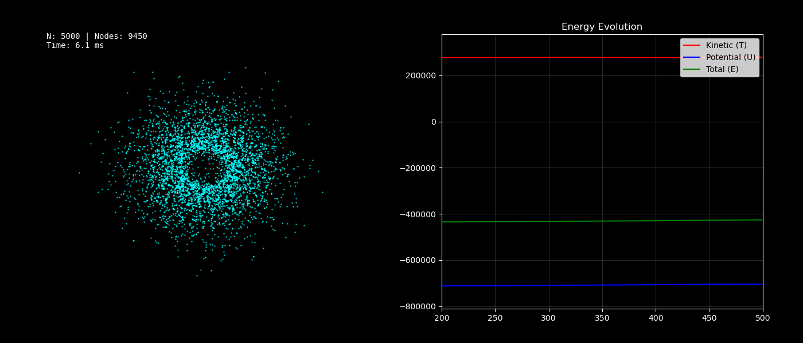
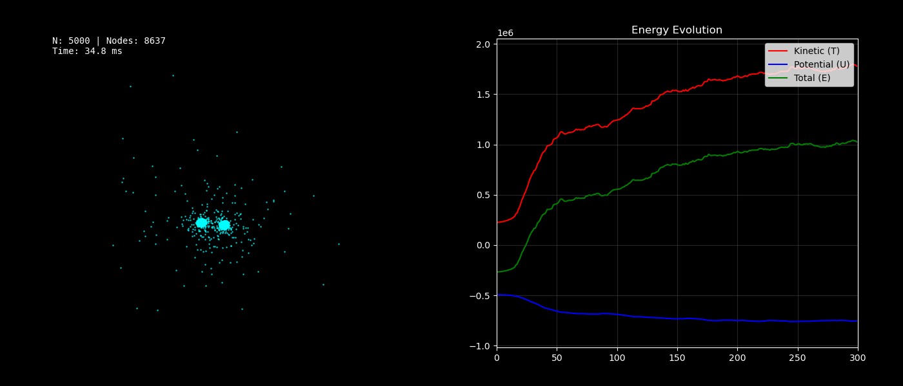

# Barnes-Hut N-Body Simulation with Numba

This project creates a high-performance simulation of gravitational interactions between a large number of bodies using the **Barnes-Hut algorithm**, optimized with **Numba JIT (Just-In-Time) compilation**.

The goal is to demonstrate how Python, typically considered slow for heavy computations, can achieve real-time performance in N-Body simulations by leveraging Data-Oriented Design and JIT compilation.

## 🚀 Performance & Features

* **High Efficiency:** Capable of simulating up to **50,000 bodies** in real-time.
* **Speed:** Achieves approximately **3.4ms per frame** with 20,000 bodies.
* **Visualization:** Real-time rendering using Matplotlib with dynamic energy monitoring.
* **Comparison:** The folder `Object Oriented Implementation/` contains a traditional recursive Python implementation. It struggles to simulate 1,000 bodies, demonstrating the improovements obtained by flattening data structures and using Numba.

## Physical Observations
The simulation includes an energy plot (Kinetic + Potential) to verify physical accuracy. Since the system is isolated, the Total Energy should stay constant.

### 1. Galaxy gaussian hole
This setup generates a supermassive black hole at the center with particles distributed in a Gaussian disk around it. Particles are initialized with Keplerian orbital velocities

**Observation**
In this scenario, the total energy remains stable and conserved. The system evolves naturally into a stable rotating disk, maintaining a plausible physical course of events.

### 2. Binary Orbiting and Box setup
These configurations initialize particles either in a random box distribution or around two orbiting heavy masses.

**Observation**
In these scenarios, you may observe non costant behaviour in the total energy graph. This behavior often indicates numerical instability caused by close interaction. 
Unlike the stable galaxy setup, these initial situations often causes some particles to pass near the origin. In this case, since we have an interaction with a supermassive body, force explodes to infinity. Since the dt is fixed it's not small enough to capture the rapid acceleration, leading the integration method (Euler/Leapfrog) to produce numerical instability. 

